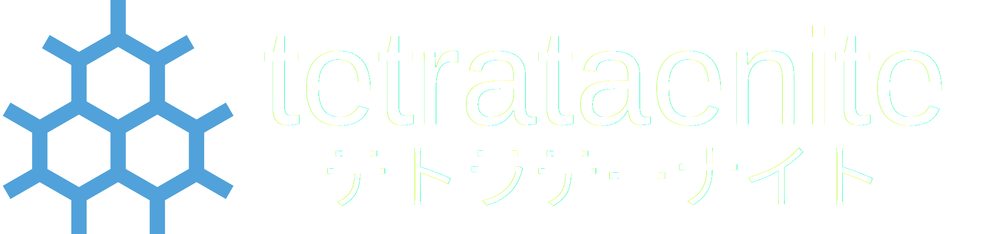

# tetrataenite &nbsp; [](https://github.com/evelynrp/tetrataenite/actions/workflows/build.yml)

tetrataenite is a desktop Linux operating system. It is built using BlueBuild and shipped as a set of OCI bootable containers, using Fedora's atomic images as a starting point.

## Why does this exist?

One can only deal with finding trojans on work computers so many times. I wanted something that was relatively maintenance-free and relatively "grandma-proof" that was still reasonably secure. [Project Bluefin](https://projectbluefin.io) was considered, but ruled out because of their insistence on flatpak browsers, which I consider to be too big a security compromise. [secureblue](https://secureblue.dev) was considered, but usability was an issue. tetrataenite is sort of like a middle ground between the two.

## What's included?

- **bootc** - Safe, atomic, automatic updates
- **brew** - Easily install CLI tools
- **Bazaar** - A fast, beautiful, and modern app store
- **Google Chrome** - Browse safely and securely with custom policies and flags

## Should I use this?

tetrataenite is tailored exactly to my own taste, and was not made with a general audience in mind. That said, if you want reasonable security out-of-the-box and reasonably little bloat, you are more than welcome to use it. Feedback and PRs are always welcome.

## How to install?

The easiest way is to rebase from an existing Fedora Atomic installation. You will have to rebase to an unsigned image first to get the proper signing keys, and then rebase again to the signed image. For example:

```bash
rpm-ostree rebase ostree-unverified-registry:ghcr.io/evelynrp/tetrataenite-gnome
systemctl reboot

rpm-ostree rebase ostree-image-signed:docker://ghcr.io/evelynrp/tetrataenite-gnome
systemctl reboot
```

Replace `tetrataenite-gnome` with your chosen image from this list:
- tetrataenite-gnome
- tetrataenite-plasma

## Design philosophy and decisions

System services handle autamatic bootc and flatpak updates. BlueBuild's brew module handles automatic updates of brew and brew-installed applications.

Firefox was removed completely and replaced with Google Chrome with policies from [RKNF404's Chromium Hardening Guide](https://github.com/RKNF404/chromium-hardening-guide). While I support Mozilla ideologically, there are some concerns about Firefox's security, especially process isolation. secureblue's Trivalent was ultimately decided against because it presents a high learning curve.

Default app stores such as Gnome Software were removed and replaced with secureblue's Bazaar rpm. This comes with "Verified Only" checked by default, and blocklists all web browsers. I considered this an essential security feature.

VS Code and some fonts were previously included, but have been removed from the image to simplify the codebase and reduce dependencies on external repositories. It is now recommended to install these via brew. You may want to tap [uBlue's homebrew tap](https://github.com/ublue-os/homebrew-tap).

Nvidia images have also been deprecated to simplify the codebase and reduce build load. Tetrataenite is not intended for gaming, video editing, local AI, or other GPU-intensive tasks. This may change in the near future.

Because this image is intended to be a turnkey solution for nontechnical users, only Gnome and Plasma images are currently available.